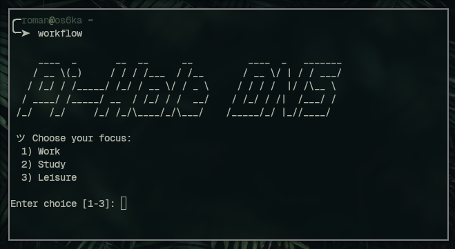

# Home DNS Server Infrastructure

This repository covers my personal DNS server setup built on Debian 13 with Pi-hole and Unbound. 

## Features include:
- Private recursive DNS resolver with **Unbound**
- Network-level ad-blocking and privacy protection with **Pi-Hole**
- Workflow-based domain filtering via bash scripts (Study, Work, Leisure)
- Integration with a Cisco Catalyst switch for VLAN-based experimentation and working within my network infrastructure.
- Documentation and notes for future expansion (e.g., media server)
---
| Workflow Selector | Remote Updater |
|--------------|--------------|
|  |  |
